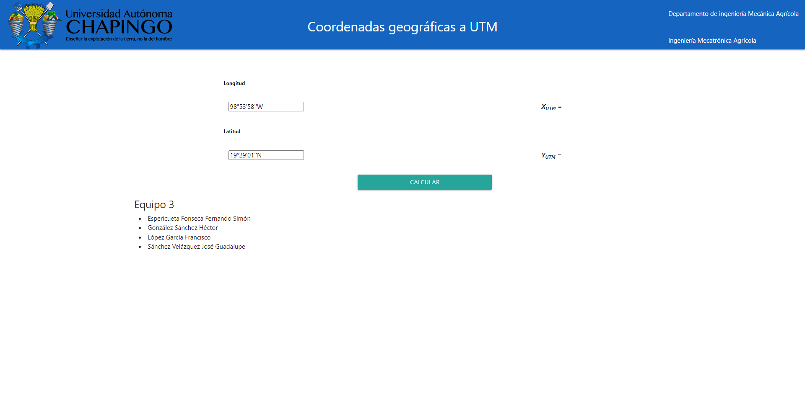

# Geographical coordinates to UTM

This was a brief scholar project used for converting geographic coordinates to UTM 
coordinates. As my first project as a Web Page, I used basic HTML, CSS and JS to build it.

## Requirements

This project requires the following Framework:
- [Materialize](https://materializecss.com/getting-started.html)